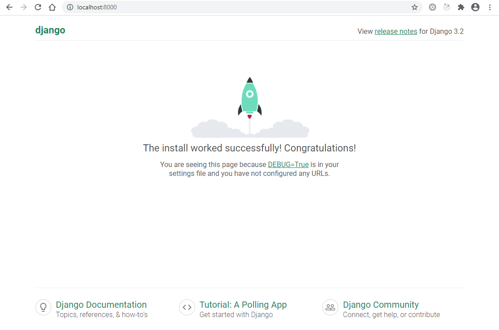
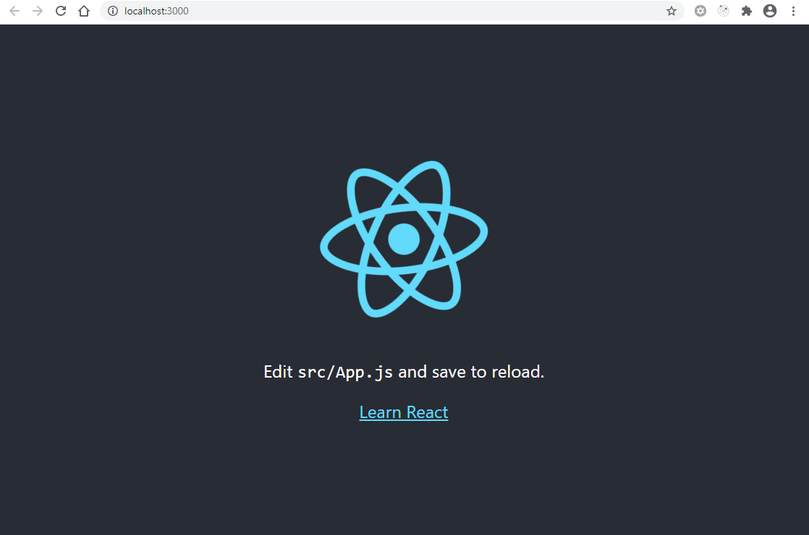

# mesh-b204d66c
This repository contains templates for a Django 3.2 project, and a React 17 app.

You will require the following to install the project dependencies and create a working development environment.
- Python 3.6+
- `pip` package installer for Python 3
- Node.js 12+
- `yarn` or `npm` package manager

Once you have installed the dependencies for the Django and React applications (contained in ~django_app/requirements.txt~ and ~react_app/package.json~ respectively), you should be able to spin-up a development server and view output in your browser as follows.

## ~django_app~
You should be able to spin up the local dev server as follows:

```
cd django_app
python manage.py runserver
```

You should be able to see the following in your browser:



## ~react_app~
You should be able to spin up the local dev server as follows (using either `yarn` or `npm`):

```
cd react_app
yarn start
```

You should be able to see the following in your browser:



